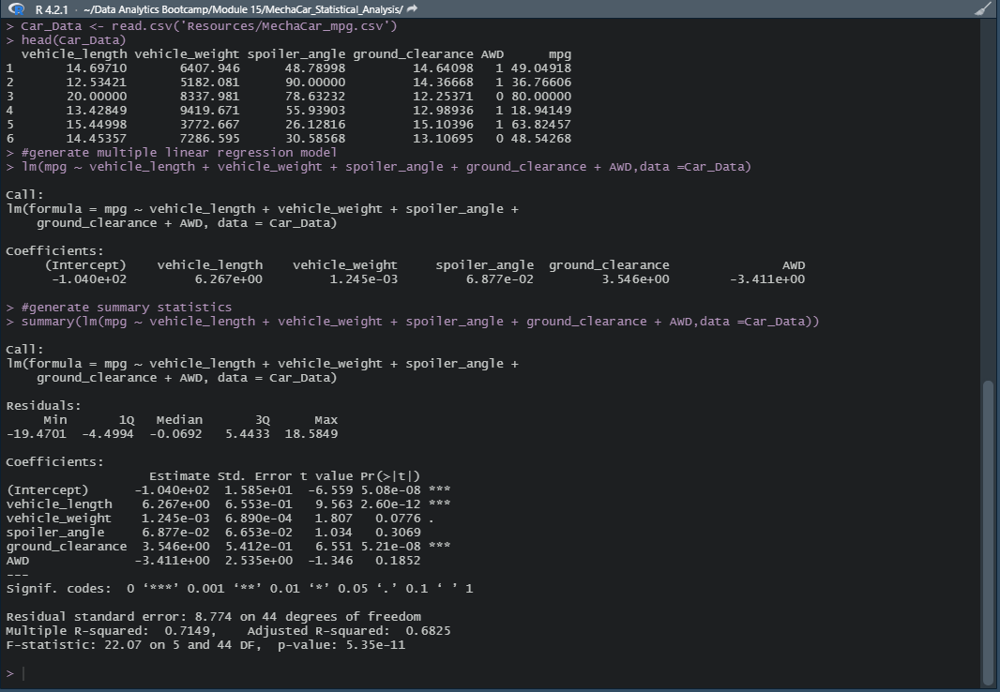

# MechaCar_Statistical_Analysis
#### Purpose: 
Analyze production troubles for AutosRUs new prototype (MechaCar) to identify MPG predictive variables, collect summary statistics on PSI of suspension coils, and run t-tests to determine statistical difference in mean population.

## Linear Regression to Predict MPG
### Analysis of test results for 50 prototype MechaCars. The MechaCar prototypes were produced using multiple design specifications to identify ideal vehicle performance. 
Multiple metrics were collected for each vehicle(such as vehicle length, vehicle weight, spoiler angle, drivetrain, and ground clearance).
A summary of the linear regression can be displayed to determine the quality of the dataset. In this distribution of the residuals, the dataset fits in with the normal parameters, where the absolute value of the min and max are comparable |-19.47|~|18.58| and the median -.07 is close to zero.

Which variables/coefficients provided a non-random amount of variance to the mpg values in the dataset?
A 95% level of confidence was predetermined, meaning the p-value should be compared to alpha = .05 level of significance to verify if statistically significant.

Is the slope of the linear model considered to be zero? Why or why not?
The multiple linear regression formula for mpg = -.01 + 6.267(vehicle length)+.001(vehicle weight)+.069(spoiler angle)+3.546(ground clearance)-3.411(AWD), which results in a non-zero slope.

Does this linear model predict mpg of MechaCar prototypes effectively? Why or why not?
R-squared is .7149, which is a strong correlation for the dataset and shows the dataset is an effective dataset. However, r-squared is not the only consideration for effectiveness. There may be other variables not included in the dataset contributing to the variation in the mpg.

## Summary Statistics on Suspension Coils
### Visulization of  results from multiple production lots. 
First the Suspicion Coil csv was converted into a dataframe and then created two subset tables with it: Total Summary and Lot Summary.

The Total Summary table is looking at PSI statistics across all lots while the Lot Summary shows statistcs of each lot (seen below). Lot 1 and 2 are very similar while Lot 3 has a smaller mean with a bigger variance and standard deviation (SD).

## T-Tests on Suspension Coils
### Based on the analysis above, the major impacts on MPG are car weight, spoiler angle, and AWD capability. 

The P-values from single T-Test on PSI values (compared to the standard of 1500 PSI) for suspicion coils were:

All PSI= 0.06028 Lot 1 PSI= 1 Lot 2 PSI= 0.6072 Lot 3 PSI= 0.04168 Assuming that the significant value should be below p = 0.05 (which is standard), then only Lot 3 is significantly different. All other lots perform the same (or are not significantly different) to the standard 1500 PSI. This, combined with the lower mean of Lot 3 and high variance, could indicate that Lot 3 is under-performing.

## Study Design: MechaCar vs Competition
As we have seen in commercials during the holiday season and Superbowl, there are many things a consume/driver would look for purchasing a new car.
A few examples are city or highway fuel efficiency, horse power, maintenance cost, or safety rating (BIG in family sized cars).

Testable metrics would include:

What metric or metrics are you going to test?
	
    - Safety-rating, and highway fuel-efficiency as two major items that cunsumers are most interested in currently.

What is the null hypothesis or alternative hypothesis?
	
    -The null hypothesis is that the mean of the safety rating is zero. The alternative hypothesis is that the mean of the safety rating is not zero.
	-Additionally a null hypothesis is a horsepower rating of zero. The alternative hypothesis is that the mean of the horsepower rating is not zero.

What statistical test would you use to test the hypothesis? And why?
	
    - A multiple linear regression statical summary would show how the variables impact safety ratings and horsepower ratings for MechaCar and any other competitor automotive companies.

What data is needed to run the statistical test?
	
    -A random sample of n > 30 for MechaCar and their competitor, would need to be collected including the safety ratings, highway fuel efficiency, and horsepower plus running the data through RStudio.